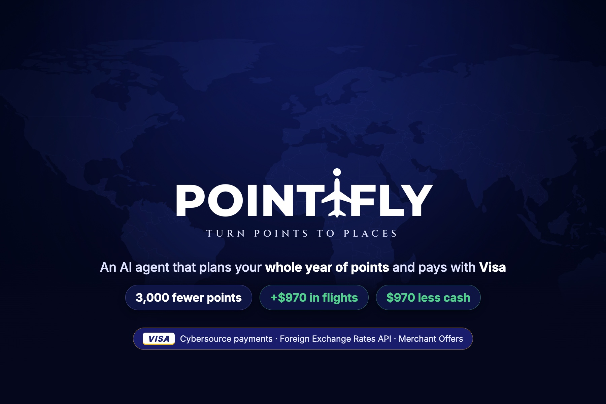
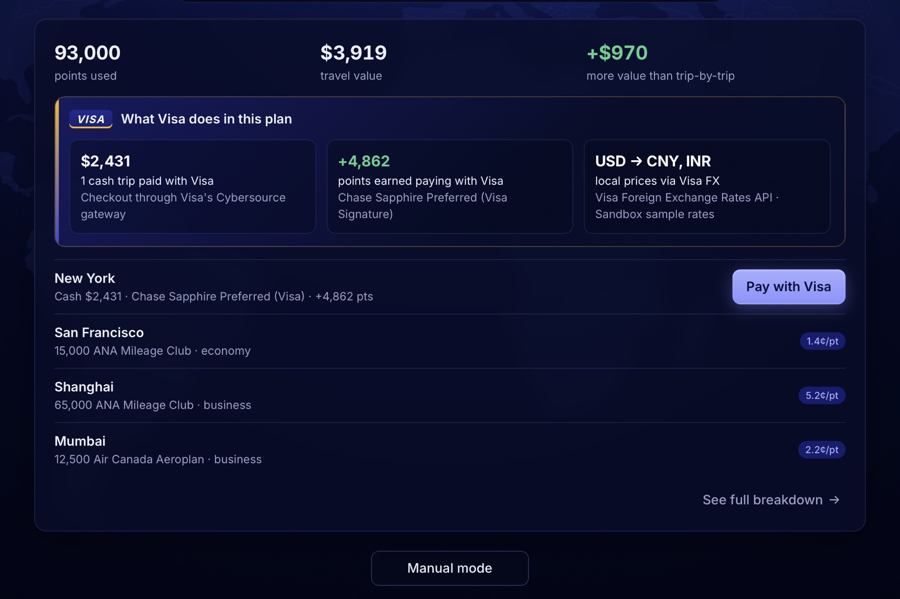
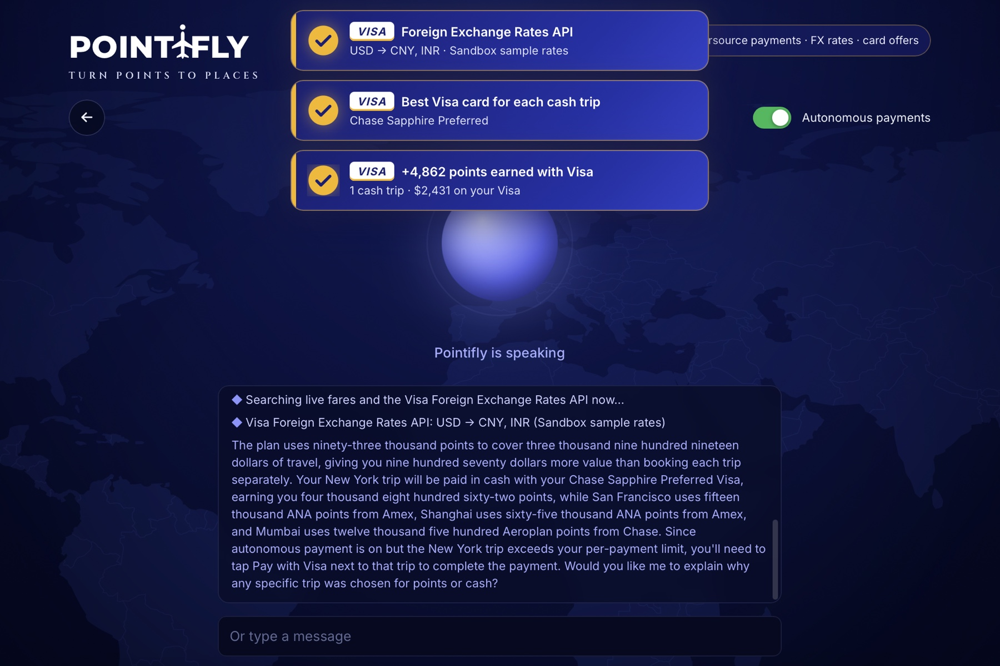
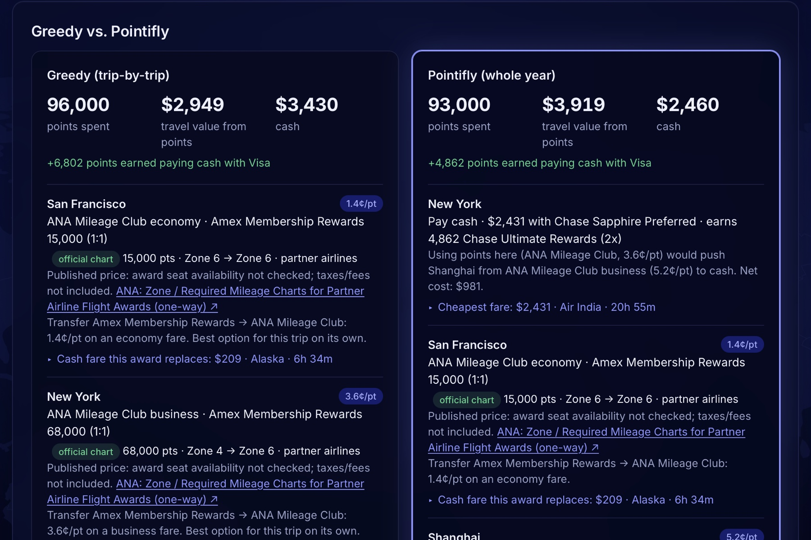

<div align="center">



# Pointifly

**Your points have commitment issues.** They go to the first flight that asks.
Pointifly is an AI travel agent that plans your **whole year** of points, then pays the cash flights **with Visa**, inside limits you control.

**[▶ Try it live](https://64.177.41.28.sslip.io)** · **[Devpost](https://devpost.com/software/pointifly)** · Built at **HackGT 13** for the **Visa** challenge *Reimagine Shopping with Generative AI*

</div>

---

## ✈️ The receipt

Our real travel year: two international students, four flights, the same points in both columns.

| | Booking trip by trip | **Pointifly** | |
|---|---:|---:|---|
| Points spent | 96,000 | **93,000** | **3,000 fewer** |
| Flights covered by points | $2,949 | **$3,919** | **+$970** |
| Cash out of pocket | $3,430 | **$2,460** | **$970 less** |

Booking one flight at a time spends 68,000 miles on the first long-haul flight (Delhi → New York, 3.6¢ a mile), leaving too few for Shanghai in business. Pointifly pays for New York on Visa instead and saves those miles for Shanghai, where each one is worth **5.2¢**.

<sub>Live Google Flights fares, official transfer ratios and award charts. Cash includes $29 of award fees.</sub>

## 🧪 Try it in 30 seconds

1. Open **[Pointifly](https://64.177.41.28.sslip.io)**, tap **Connect with Plaid**, then **Continue**.
2. The agent greets you. Allow the microphone and say (or type):

> I have 90,000 Amex points, 50,000 Chase Sapphire Preferred points, 35,000 United miles and nothing in Capital One. Delhi to New York in business on December 3, 2026. New York to San Francisco in economy on November 12, 2026. New York to Shanghai in business on January 12, 2027. New Delhi to Mumbai in business on February 2, 2027.

**Watch for** the gold **Visa** labels as it calls Visa's APIs, the plan above rebuilt live, and a **guardrail**: New York costs $2,431, over the agent's $1,000 per-payment limit, so it won't pay on its own. No mic? Type into the box under the circle, or use **Manual mode**.

---

## What it does

**Talk → plan → pay.**

1. **Talk.** Connect your cards, then tell the agent your balances and trips in one sentence, by voice or text. It asks only for what's missing.
2. **Plan.** It finds live fares, explains how your points transfer, and optimizes **the whole year at once**, side by side with booking trip by trip.
3. **Pay.** For flights that are better paid in cash, it picks the Visa card that earns the most, asks you once, and pays through **Visa's Cybersource gateway**, within spending limits you control.



| Stage of the shopping journey | What Pointifly does |
|---|---|
| **Discovery** | Finds the cheapest live fare for every trip on Google Flights |
| **Decision-making** | Points (which program, which transfers) or cash, for every trip |
| **Personalization** | Your cards, your balances, your dates |
| **Loyalty & rewards** | Gets the most from your points across the year, and earns more on every cash trip |
| **Checkout & payments** | The agent pays with your best Visa card through Cybersource, after one confirmation |
| **Post-purchase** | An audit log of every payment attempt: paid, blocked, and why |

## 💳 Built on Visa

You can **see** Visa working: a gold label appears each time the agent calls a Visa service.



| Visa service | What it does in Pointifly |
|---|---|
| **Cybersource Payments API** (REST, official SDK) | The agent's checkout: pays each cash trip at the plan's amount with the plan's Visa card (Sandbox) |
| **Visa Foreign Exchange Rates API** (two-way SSL) | Local prices for international trips; fetched at most once per currency pair per day, labelled as Sandbox sample rates |
| **Visa Merchant Offers Resource Center** | Real Visa travel benefits, shown only to cardholders whose card tier qualifies (e.g. Visa Infinite) |
| **Visa card rewards in the optimizer** | For every cash trip, the Visa card that earns the most, from issuers' official earn rates; earned points fund later trips |

## 🛡️ Trusted agentic payments

**The agent can ask; only the server decides.**

- **You're in control:** an **Autonomous payments** switch plus per-payment and total **spending limits**. Switch it off and only you can pay.
- **One approval before money moves.** Planning is free and reversible, so it runs without interruptions.
- **The agent can't change the amount or the card.** It names a trip; the amount and card come from the server's copy of the plan. Requests with extra fields like `amount` or `card` are rejected.
- **No double charges, no runaway loops:** one payment per trip, and a cap on attempts per minute.
- **An audit log** records every attempt with the reason, and the gateway's real reply.
- **Card data stays out of the AI.** Plaid returns card names and last four digits only; payments run server-side.
- **Tested against attacks:** SQL-injection strings, prompt-injection phrasing and tampered payment requests are fired at every payment endpoint, and the tests check that **nothing reaches the gateway**. There's no SQL database to inject into, and every input is validated.

## 🎙️ The voice agent (ElevenLabs)

**AI where flexibility helps; math where money is at stake.** The agent understands you and runs the steps. The numbers come from a deterministic optimizer, never from the model.

- **Five client tools:**
  - `fill_trip_plan`: Gemini turns your words into trips and balances, which are then validated.
  - `describe_programs`: the official transfer ratios for your cards.
  - `run_optimizer`: the whole-year plan.
  - `explain_trip`: why a trip is points or cash.
  - `pay_cash_leg`: asks the server to pay.
- **RAG knowledge base:** official transfer ratios, award charts, Visa earn rates and how Pointifly decides. Public reference data only, never user data.
- **Guardrails in the prompt, and enforced again by the server:** it never asks for card data, takes every number from the tools, ignores instructions that try to change amounts or limits, and is told live when you flip the switch or change a limit.
- **Built for real rooms:**
  - It greets you in about a second.
  - Interruptions are off and turn-taking is patient, so background voices can't take over.
  - Recognition keywords cover program and airport names.
  - A pronunciation dictionary makes it say "Point-ih-fly".
  - It switches to typing when there's no microphone.
- **Private by design:** the API key stays on the server, the browser gets a 15-minute signed URL, and your balances and cards never live on ElevenLabs.

## 🛠️ How it works

```text
You (voice or text)
   ▼
ElevenLabs agent ◀── RAG: official ratios · award charts · Visa earn rates
   ▼  client tools
Gemini ──▶ trips & balances, checked against ~4,500 airports and real dates
   ▼
Google Flights (SerpApi) + Visa FX Rates API ──▶ live fares, local currencies
   ▼
OR-Tools CP-SAT optimizer ──▶ best whole-year plan (and the trip-by-trip plan to compare)
   ▼
Server-side guardrails ──▶ your switch · your limits · amount & card fixed · audit log
   ▼
Cybersource Payments API ──▶ paid with your best Visa card
```

### The optimizer

An integer program over trips $t$, payment options $o$ (cash, or an award in program $p_o$), holdings $h$ and Visa cards $k$:

$$\max\;\sum_{t,o}\big(V_o - F_o\big)\,y_{t,o}\;-\;\sum_{h,t,o}\rho_h\,x_{h,t,o}\;+\;\sum_{t,k}\rho_{k}\,E_{t,k}\,z_{t,k}$$

subject to

$$\sum_o y_{t,o} = 1 \qquad \sum_h r_{h,p_o}\,x_{h,t,o} \ge P_o\,y_{t,o} \qquad x_{h,t,o} \in b_h\,\mathbb{Z}_{\ge 0} \qquad \sum_{t' \le t}\sum_o x_{h,t',o} \le B_h + \text{earned}_h(t)$$

- **The decisions:**
  - $y_{t,o}$: which option pays for trip $t$.
  - $x_{h,t,o}$: how many points move out of holding $h$, in official transfer blocks $b_h$.
  - $z_{t,k}$: which Visa card pays a cash trip.
- **The data:** $V_o$ is the cash fare an award replaces, $F_o$ its fees, $P_o$ its price in miles, $r$ the official transfer ratio, and $B_h$ your balance.
- **Reserve value:** $\rho_h$ is what a point is worth if you keep it (1¢), so an award only wins if it beats saving the points.
- **Earned points:** $E_{t,k}$ is the points card $k$ earns on trip $t$, usable 30 days later.
- **A fair comparison:** booking trip by trip is the **same model** run one trip at a time in date order. The only difference is scope.
- **Exact, not a guess:** OR-Tools CP-SAT proves the plan is optimal. On our travel year that took **21 ms**, with a 10-second safety cap.



---

## Data sources

| Data | Source | Status |
|---|---|---|
| Cash fares | Google Flights via [SerpApi](https://serpapi.com/google-flights-api) | **Live**; saved after the first search (`app/data/snapshots.json`) |
| Award prices | Official charts: [Aeroplan 2026-08](https://www.aircanada.com/content/dam/aircanada/loyalty-content/documents/flight-rewards-chart-en.pdf) and [ANA partner chart](https://www.ana.co.jp/en/jp/guide/amc/award/tk/zone/) | **Official**; seat availability not checked. We never invent a price |
| Transfer ratios | [Amex](https://global.americanexpress.com/rewards/transfer?tier=MR), [Chase](https://www.chase.com/sapphire-cards/personal/preferred), [Capital One](https://www.capitalone.com/learn-grow/money-management/venture-miles-transfer-partnerships/) official pages | **Official**, verified 2026-09-26, with minimums, blocks and transfer times |
| Card earn rates | [Sapphire Preferred](https://www.chase.com/sapphire-cards/personal/preferred), [United Explorer](https://creditcards.chase.com/travel-credit-cards/united/united-explorer), [Venture](https://www.capitalone.com/credit-cards/venture/) | **Official**, verified 2026-09-26 |
| Currency conversion | [Visa Foreign Exchange Rates](https://developer.visa.com/capabilities/foreign_exchange) | **Visa Sandbox**: sample rates (7–44% off ECB reference rates), labelled "not live" in the app |
| Card benefits | [Visa Merchant Offers Resource Center](https://developer.visa.com/capabilities/vmorc) | **Visa Sandbox**; shown only for eligible card tiers |
| Payments | [Cybersource](https://developer.cybersource.com/hello-world/testing-guide.html) via the official Python SDK | **Sandbox**, test card, no money moves |
| Linked cards | [Plaid](https://plaid.com/docs/) | **Sandbox** institutions (Amex, Chase, Capital One) |
| Airports | [OurAirports](https://ourairports.com/data/) | Public domain |
| Trip parsing · voice | Gemini · ElevenLabs Agents | **Live** |

## Tech stack

**Backend:** Python, FastAPI, Pydantic, OR-Tools CP-SAT, pytest · **Frontend:** React, TypeScript, Vite, Recharts, Web Audio API · **AI:** ElevenLabs Agents (tools + RAG), Gemini · **APIs:** Visa (Cybersource, FX Rates, VMORC), Plaid, SerpApi · **Deploy:** Vultr (Ubuntu), Caddy (HTTPS), uv

## Run it locally

```bash
cd backend && uv venv .venv && uv pip install --python .venv/bin/python -r requirements-dev.txt
.venv/bin/uvicorn app.main:app --port 8000
```

```bash
cd frontend && npm install && npm run dev
```

Open http://localhost:5173 (Vite proxies `/api` to `:8000`). Copy `backend/.env.example` to `backend/.env` for the integrations; without keys, everything falls back to cached or sample data.

### Keys (`backend/.env`)

Never commit `.env`; certificates go in `backend/secrets/` (git-ignored). See `backend/.env.example`.

- **SerpApi:** `SERPAPI_KEY`. `SERPAPI_DAILY_LIMIT` caps live searches per day (default 20); saved fares always work.
- **Plaid:** `PLAID_CLIENT_ID`, `PLAID_SECRET`, `PLAID_ENV=sandbox`. `PRESENTATION_MODE=1` hides environment tags and developer controls.
- **Visa:** a Visa Developer project with Foreign Exchange Rates and Merchant Offers Resource Center. For two-way SSL, put the certificate and key in `backend/secrets/`, then set `VISA_USER_ID`, `VISA_PASSWORD` (the project's two-way SSL credentials), `VISA_CERT_PATH` and `VISA_KEY_PATH`.
- **Cybersource:** a Sandbox account with a **REST – Shared Secret** key: `CYBERSOURCE_MERCHANT_ID`, `CYBERSOURCE_KEY_ID`, `CYBERSOURCE_SECRET_KEY`.
- **Gemini:** `GEMINI_API_KEY` (optional `GEMINI_MODEL`, default `gemini-3.5-flash-lite`).
- **ElevenLabs:** `ELEVENLABS_API_KEY`, then `.venv/bin/python -m app.ai.voice --setup`. It creates the knowledge base, tools, pronunciation dictionary and agent once, and updates only what changed. Put the printed `ELEVENLABS_AGENT_ID` in `.env`. The key needs the convai, knowledge base and pronunciation dictionary permissions.

### API usage

- **SerpApi:** free plan, 250 searches a month. Each new route + date + cabin is searched once, then saved. An identical search saved under another trip is reused.
- **Visa:** at most one FX call per currency pair and one offers call per day. Both are cached, so the demo works offline.
- **Cybersource:** one gateway call per payment, and no trip is charged twice. As of 2026-09-26 our Sandbox account returns `502 SERVER_ERROR` (authentication succeeds; the processor isn't enabled on the account). Checkout completes in demo mode, and the audit log records the gateway's real reply. Gateway IDs are never invented.
- **Tests never call real APIs:** `backend/tests/conftest.py` fakes Visa, SerpApi, Cybersource, Gemini and ElevenLabs, and blocks network access unless `RUN_LIVE_TESTS=1`.

## Tests

```bash
cd backend && .venv/bin/python -m pytest -q
```

141 tests: the optimizer, award charts, custom trips, Visa FX and offers, checkout, Plaid, AI parsing and agent setup, plus `test_agent_payments.py`, which attacks every payment guardrail.

## Deploy (Vultr or any Ubuntu 24.04 / 26.04 server)

```bash
./deploy/deploy.sh root@SERVER_IP                            # https://SERVER_IP.sslip.io
ACCESS_PASSWORD=choose-one ./deploy/deploy.sh root@SERVER_IP  # same, behind a password (user "demo")
```

The script:
- builds the frontend;
- copies the code, `backend/.env` and `backend/secrets/` over SSH;
- installs Python 3.12 (via uv) and Caddy;
- runs the API as one always-on service (plans and payment limits live in memory), with presentation mode on;
- serves everything over automatic HTTPS, which browsers require for the microphone.

Re-run it to update; the server keeps its own caches and usage counters.

## Project layout

```text
backend/
  app/optimizer.py      the integer program (whole year and trip by trip)
  app/planning.py       plans, explanations, API response
  app/agentpay.py       agent payment guardrails and audit log
  app/ai/               Gemini parser, ElevenLabs agent setup (tools, RAG, pronunciation)
  app/visa/             Visa FX Rates and Merchant Offers (two-way SSL)
  app/cybersource/      checkout through the Cybersource SDK
  app/plaid/            card linking
  app/data/             official ratios, award charts, earn rates, saved fares
  tests/                141 tests, all external APIs faked
frontend/src/
  components/VoiceAgent.tsx    the agent page and speaking circle
  components/VisaMoments.tsx   the gold Visa labels
  components/Dashboard.tsx     trip by trip vs Pointifly
deploy/                 one-command Vultr deploy
```

---

<div align="center">

Built at **HackGT 13** by two international students who fly home every year.
**Same wallet. Same trips. Planned as a year.**

</div>
